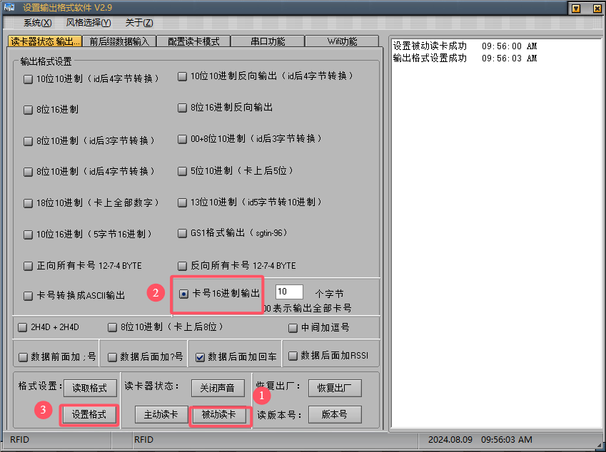
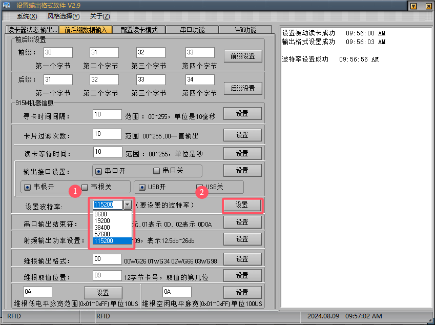
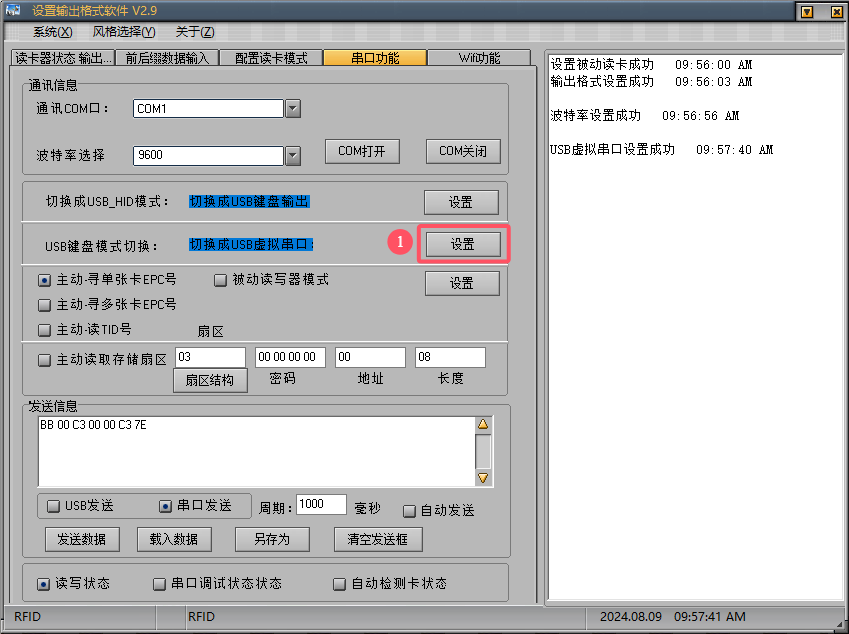
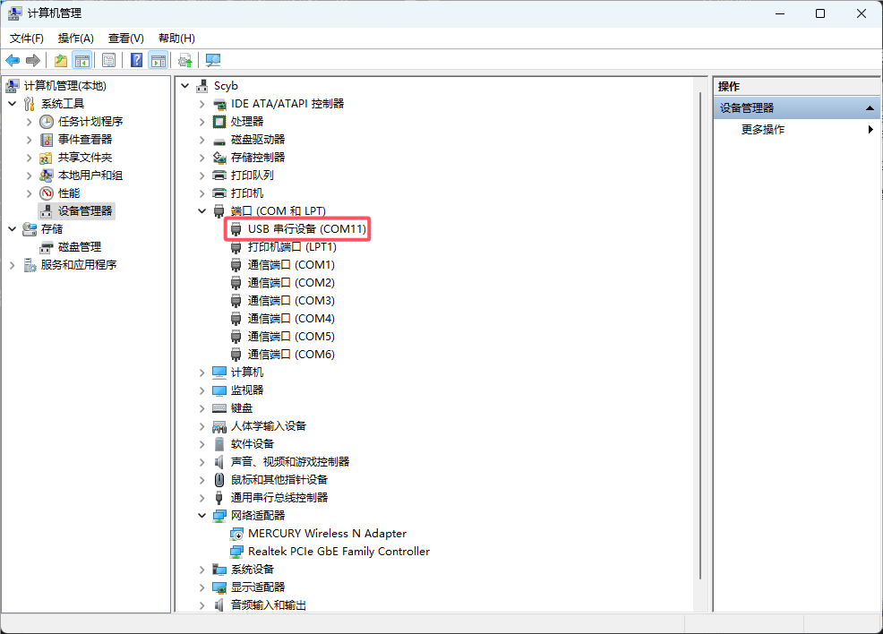
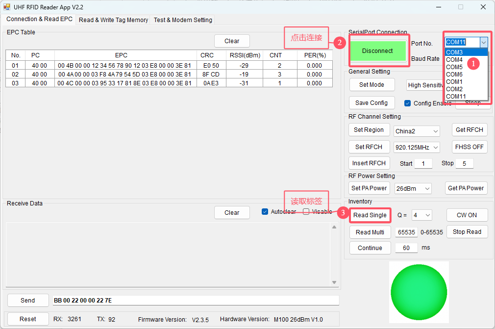
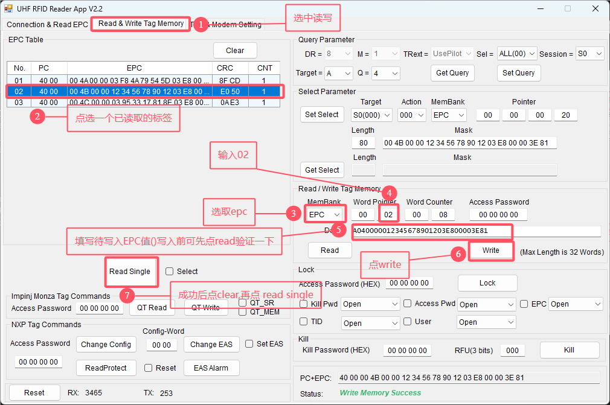
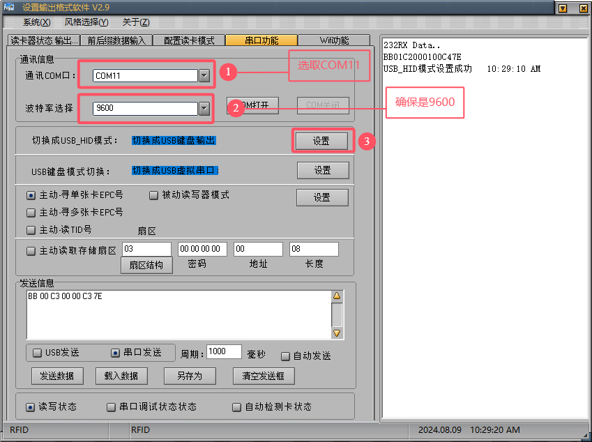

# UHF 一体机( 21N)读写操作流程

<!-- 
 -->

<!-- 
设置被动模式,进行读写
 -->

## 设置被动模式,进行读写

1. 打开 2.9 版本配置软件.exe([下载地址](https://github.com/rosscarsen/HUF-21N/releases/download/1.0.0/set.zip))
2. 读卡器状态 
3. 前后缀数据输入 
4. 串口功能 
5. 检查驱动
   - 此电脑
   - 设备管理器
   - COM 端口 
6. 打开读写软件 RFID_Reader_Csharp.exe（[下载地址](https://github.com/rosscarsen/HUF-21N/releases/download/1.0.0/RFID.zip)）
7. 读取标签 
8. 写入标签 

<!-- 
 -->

## 关门被动模

1. 如当前已运行 RFID_Reader_Csharp.exe，断开连接
2. 打开 2.9 版本配置软件.exe
3. 切换到串口
4. 关闭串口 
